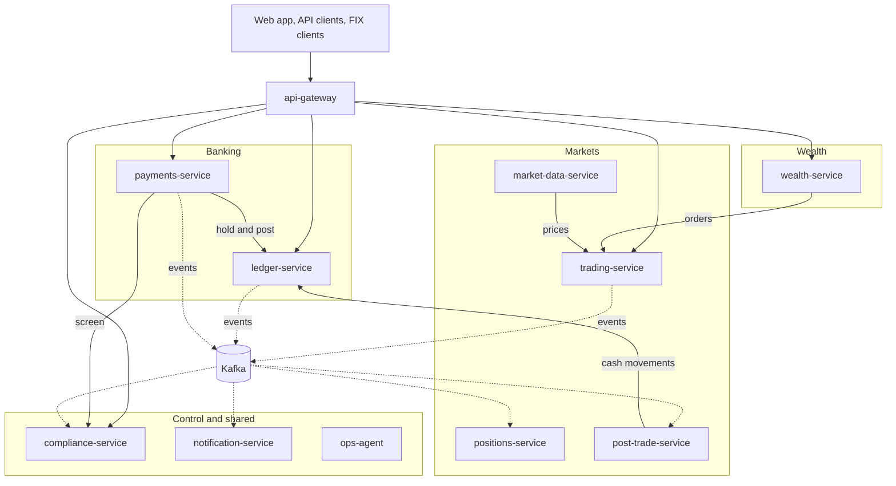

# Banking Platform

[](https://github.com/sainageshgowrabalaji/Banking-Platform/actions/workflows/ci.yml)

One platform that covers the main lines of business of a bank or finance firm. Retail banking and
payments, trading, risk, post-trade, wealth management and compliance, built as Java microservices on
one shared core.

The stack follows what finance firms in New York ask for most in their job postings, which is Java,
Spring Boot, Kafka, PostgreSQL, Kubernetes and AWS, with FIX and ISO 20022 as the industry message
standards.

## Status

**Skeleton stage, October 2026.** The structure is in place so each part can be built and improved
one phase at a time. This table says exactly what exists today.

| Part | Today |
|---|---|
| Build | One Maven build with 3 shared libraries and 11 services, checked by GitHub Actions on every push |
| Shared libraries | Working code with tests. Exact money, the event envelope, the idempotency key, the error format |
| Ledger rules | Working code with tests. A journal entry cannot exist unless its debits equal its credits |
| API gateway | Routes every service by path |
| Services | Each one starts, reports health and metrics, and answers `GET /v1/info`. No business endpoints yet |
| API contracts | Drafts for ledger, payments and trading (OpenAPI), events (AsyncAPI) and market data (gRPC) |
| Local tools | A Docker Compose file for PostgreSQL, Kafka, Redis, Keycloak and Grafana. The services do not use them yet |
| Deployment | A Helm chart and Terraform files as stubs. Nothing has been deployed |

The [roadmap](docs/roadmap.md) lists what each phase adds.

## Architecture



Solid lines are direct calls. Dotted lines are events. Each service owns its own database, and no
service reads the database of another.

More detail is in [docs/architecture.md](docs/architecture.md).

## Services

| Service | Area | Port | Phase | What it does |
|---|---|---|---|---|
| [api-gateway](services/api-gateway) | Edge | 8080 | 1 | The single entry point. It routes each request to the right service. |
| [ledger-service](services/ledger-service) | Banking | 8101 | 1 | Accounts, holds and the double-entry journal. Every balance is the sum of entries that never change. |
| [payments-service](services/payments-service) | Banking | 8102 | 1 | The life of a payment, from request to settlement. |
| [notification-service](services/notification-service) | Shared | 8103 | 1 | Tells customers what happened, driven by events. |
| [compliance-service](services/compliance-service) | Control | 8201 | 2 | The checks a regulator expects before and after money moves. |
| [market-data-service](services/market-data-service) | Markets | 8301 | 2 | Prices for every instrument the platform trades. |
| [trading-service](services/trading-service) | Markets | 8302 | 2 | Takes orders, checks them and matches them. |
| [positions-service](services/positions-service) | Markets | 8303 | 3 | What each account holds and what it is worth. |
| [post-trade-service](services/post-trade-service) | Markets | 8304 | 3 | Everything that happens after a trade is done. |
| [wealth-service](services/wealth-service) | Wealth | 8401 | 3 | Managed portfolios for private clients. |
| [ops-agent](services/ops-agent) | Shared | 8501 | 4 | An AI agent that helps the people who run the platform. |

Shared code lives in [libs](libs).

## Run it

You need JDK 21 or newer. Docker is not needed yet.

```bash
java -version                    # must say 21 or newer
./mvnw verify                    # builds every module and runs every test
```

If Java is older than 21, install it with `brew install --cask temurin@21`, or download it from
adoptium.net. The first build downloads Maven and the libraries, so it takes a few minutes.

Then start two services and call one through the gateway.

```bash
scripts/run.sh ledger-service    # terminal 1
scripts/run.sh api-gateway       # terminal 2
curl http://localhost:8080/ledger/v1/info
```

`scripts/smoke.sh` asks every running service who it is, directly and through the gateway.

## What is where

```
libs/         shared code (money, events, web)
services/     one folder per microservice, each with its own README
contracts/    the APIs, written before the code (OpenAPI, AsyncAPI, proto)
infra/        Docker Compose for the local tools, and the shared Dockerfile
deploy/       Helm chart and Terraform for the cloud
docs/         architecture, learning path, glossary, roadmap, decisions
scripts/      run one service, smoke test
```

## Design rules already in the code

- Money is never a floating point number. It is an exact decimal with its currency
- A journal entry checks its own rules when it is built, so a bad entry cannot reach the database
- Business rules live in a `domain` package with no framework imports
- Every service has the same layout, the same health checks and the same metrics endpoint
- Errors have one format across all services (RFC 9457 problem details)
- Every event has one envelope with an id, so consumers can skip duplicates

## Docs

| Doc | What it covers |
|---|---|
| [Architecture](docs/architecture.md) | The services, how a payment flows, who owns which data |
| [Learning path](docs/learning-path.md) | Gateway, load balancing, discovery, resilience, messaging, security, cloud, and where each one lives in this code |
| [Glossary](docs/glossary.md) | Banking, payments, trading and wealth terms in plain words |
| [Roadmap](docs/roadmap.md) | What each phase adds |
| [Decisions](docs/adr) | Why the project is built the way it is |

## Not real money

This is a learning and portfolio project. It does not connect to a real bank, a real payment network or
a real exchange. Rails, prices and counterparties are simulated.

Built by Sai Nagesh Gowra Balaji.
