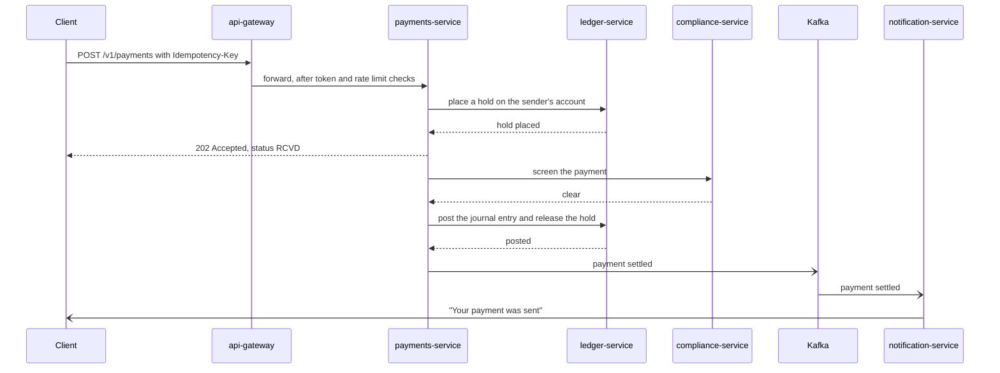
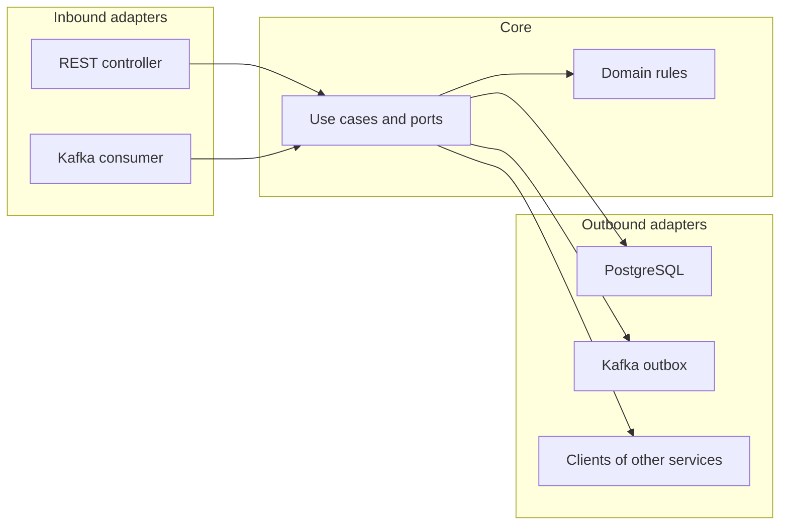

# Architecture

## The idea

A bank is many businesses on one core. A payment, a stock trade and a portfolio rebalance all end the
same way, which is money moving between accounts in a ledger. So this platform has one ledger at the
centre, and one slice per line of business built around it.

| Area | Services | The business it models |
|---|---|---|
| Banking | ledger, payments | Retail and commercial banking, treasury services |
| Markets | market-data, trading, positions, post-trade | Sales and trading, hedge funds, prime services |
| Wealth | wealth | Wealth management and private clients |
| Control | compliance | KYC, sanctions, AML, surveillance |
| Shared | api-gateway, notification, ops-agent | Platform engineering |

## How a payment will flow

This is the phase 1 target. It shows why the platform needs a saga, a hold and an outbox.

If screening fails, or the rail rejects the payment, the saga runs its undo step. The hold is released
and the payment ends as RJCT with a reason code. No step ever leaves money half moved.

## Inside one service

Every service has the same hexagonal layout.

Dependencies point inward. The domain knows nothing about Spring, the database or Kafka, so its rules
can be tested in milliseconds with plain JUnit. `JournalEntry` in the ledger service is the first
example.

## Who owns which data

| Service | Owns |
|---|---|
| ledger | Accounts, holds, journal entries, balances |
| payments | Payments and their saga state, idempotency records |
| compliance | Customer risk ratings, screening results, cases, the audit log |
| trading | Orders, executions, order books |
| positions | Positions, profit and loss, risk numbers |
| post-trade | Allocations, settlement instructions, breaks |
| wealth | Model portfolios, client portfolios, performance |
| market-data | Ticks and reference data |

A service never reads the database of another. It calls the owner's API for a fresh answer, or keeps its
own copy built from the owner's events.

## Ports

| Port | Service |
|---|---|
| 8080 | api-gateway |
| 8101 to 8103 | ledger, payments, notification |
| 8201 | compliance |
| 8301 to 8304 | market-data, trading, positions, post-trade |
| 8401 | wealth |
| 8501 | ops-agent |
| 8090 | Keycloak |
| 3000 | Grafana |
| 5432, 9092, 6379 | PostgreSQL, Kafka, Redis |

## Two ways services talk

A direct call (REST or gRPC) is used when the caller needs the answer now, such as placing a hold. The
caller sets a timeout and a circuit breaker, because the other side can be slow or down.

An event (Kafka) is used when the caller only needs to announce a fact, such as "payment settled". The
publisher does not know or care who listens. This is how notification, positions and post-trade stay
independent of the services that feed them.
