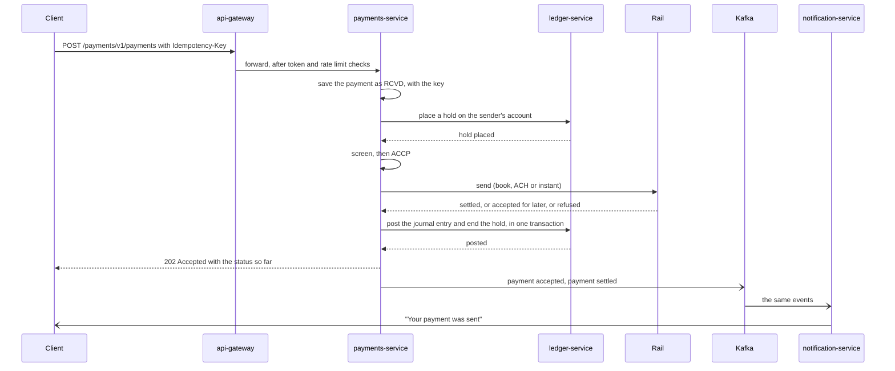
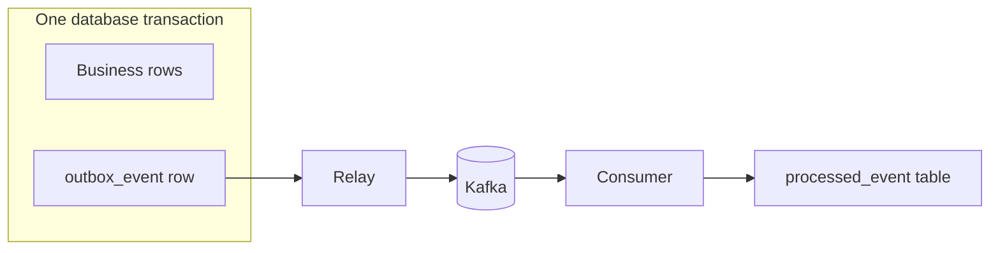
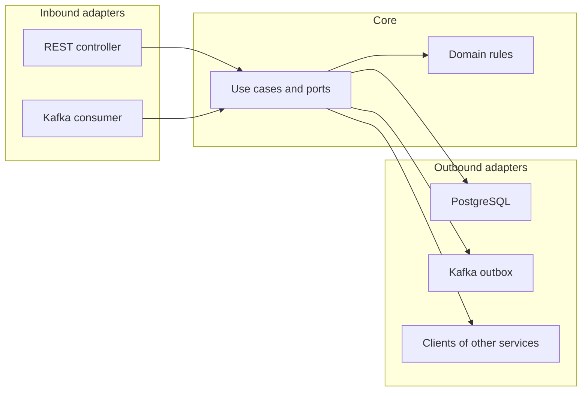

# Architecture

## The idea

A bank is many businesses on one core. A payment, a stock trade and a portfolio rebalance all end the
same way, which is money moving between accounts in a ledger. So this platform has one ledger at the
centre, and one slice per line of business built around it.

| Area | Services | The business it models |
|---|---|---|
| Banking | ledger, payments | Retail and commercial banking, treasury services |
| Markets | market-data, trading, positions, post-trade | Sales and trading, hedge funds, prime services |
| Wealth | wealth | Wealth management and private clients |
| Control | compliance | KYC, sanctions, AML, surveillance |
| Shared | api-gateway, notification, ops-agent | Platform engineering |

## How a payment flows

This is what phase 1 does today. It shows why the platform needs a hold, a saga and an outbox.



The four steps and their undo.

| Step | What it does | If it fails |
|---|---|---|
| 1. Reserve | A hold in the ledger. The money stays in the account but nothing else can spend it | Not enough money ends the payment as RJCT with AM04. Nothing to undo |
| 2. Screen | Checks the receiver against a list of blocked names | RJCT with RR04, and the hold is released |
| 3. Send | Saves that the payment is leaving, then hands it to its rail | A refusal from the rail ends it as RJCT with the rail's reason, and the hold is released |
| 4. Settle | One journal entry that debits the sender, credits the receiver or the settlement account, and ends the hold | This is the point of no return. Once a rail has paid out, the payment is never called rejected |

A payment always ends as ACSC (settled), RJCT (rejected) or CANC (cancelled). No step ever leaves
money half moved.

### What makes it safe

- **The state is in the database.** Each step saves its result in the payment row. If the service
  stops halfway, a background worker finds the payment and carries on from where it was
- **Every step can be repeated.** Each call to the ledger carries the payment's own reference, and
  the ledger does a reference once. Doing a step twice changes nothing
- **One worker at a time.** A step first claims the payment row for a minute, so two copies of the
  service never work on the same payment
- **If the ledger is down the payment waits.** The client still gets 202, and the worker tries again
  after 2, 4, 8 and up to 60 seconds. A circuit breaker stops the calls while the ledger is failing
- **Cancelling has a hard edge.** The saga saves that a payment is leaving before it calls the
  rail, and only a payment not yet marked that way can be cancelled
- **A payment that keeps failing is parked.** After ten unexpected errors in a row it is set aside
  for a person, with the error kept, and a metric counts how many are waiting

### The three rails

| Rail | How it settles | Messages |
|---|---|---|
| BOOK | Both accounts are in this bank, so it settles at once with one journal entry | None |
| INSTANT | The other bank answers in seconds. Yes settles it, no rejects it | pacs.008 out, pacs.002 back |
| ACH | The payment waits for the next batch, and the batch settles later. After the cut-off time it goes out on the next business day | Batches of entries with trace numbers |

The rails are simulated inside the payments service. An account number ending in 0000 is closed,
1111 does not exist and 2222 is blocked, so every outcome can be tried.

## How an event leaves a service



A service never calls Kafka from its business code. It writes the event into an `outbox_event` table
in the same transaction as the business change, so either both are saved or neither is. A relay reads
the table in order and sends each row to Kafka. Only one copy of a service relays at a time, which
it decides with a PostgreSQL advisory lock.

The relay can send an event twice, for example if it stops after Kafka took the event but before the
row was marked. So every consumer stores the ids it has handled in a `processed_event` table, in the
same transaction as its own work, and skips an id it has seen.

## How a balance stays right

The ledger is the one place where a mistake costs real money, so it is defended in three layers.

| Layer | What it stops |
|---|---|
| Domain | `JournalEntry` cannot be built unless debits equal credits. `Account` refuses a debit that would overdraw it |
| Locks | Posting locks every account it touches, in id order, and reads everything else after that. Two transfers cannot both spend the same money, cannot deadlock, and the same request sent twice at once is done once |
| Database | A trigger checks on commit that every entry balances. A check constraint refuses a negative customer balance. Triggers refuse any update, delete or truncate of a posted entry |

Each account row carries a running balance, so reading a balance is one row. A view named
`account_balance_mismatch` compares every running balance with the sum of its postings. It must
always be empty, and a test checks that it is after 40 payments at once.

## Inside one service

Every service has the same hexagonal layout.



Dependencies point inward. The domain knows nothing about Spring, the database or Kafka, so its rules
can be tested in milliseconds with plain JUnit. An architecture test in each service fails the build
if a domain class imports Spring, or if anything depends on an adapter.

The ledger uses JPA for its database code and the payments service uses plain SQL. Both styles are
common in banks, so the project shows both.

## Who owns which data

| Service | Owns |
|---|---|
| ledger | Accounts, holds, journal entries, balances |
| payments | Payments and their saga state, ISO 20022 messages, ACH batches |
| notification | The notifications it sent |
| compliance | Customer risk ratings, screening results, cases, the audit log |
| trading | Orders, executions, order books |
| positions | Positions, profit and loss, risk numbers |
| post-trade | Allocations, settlement instructions, breaks |
| wealth | Model portfolios, client portfolios, performance |
| market-data | Ticks and reference data |

A service never reads the database of another. It calls the owner's API for a fresh answer, or keeps its
own copy built from the owner's events.

Each service that takes writes also keeps its own `idempotency_record` and `outbox_event` tables.

## Ports

| Port | Service |
|---|---|
| 8080 | api-gateway |
| 8101 to 8103 | ledger, payments, notification |
| 8201 | compliance |
| 8301 to 8304 | market-data, trading, positions, post-trade |
| 8401 | wealth |
| 8501 | ops-agent |
| 8090 | Keycloak |
| 3000 | Grafana |
| 5432, 9092, 6379 | PostgreSQL, Kafka, Redis |

## Two ways services talk

A direct call (REST or gRPC) is used when the caller needs the answer now, such as placing a hold. The
caller sets a timeout and a circuit breaker, because the other side can be slow or down. The payments
service calls the ledger this way, and the gateway calls every service this way.

An event (Kafka) is used when the caller only needs to announce a fact, such as "payment settled". The
publisher does not know or care who listens. This is how notification, positions and post-trade stay
independent of the services that feed them.

## One trace across four services

Every service sends traces, metrics and logs with OpenTelemetry. The trace context travels in the
`traceparent` header on HTTP calls. For events it is saved in the outbox row and sent as a Kafka
header, so the consumer joins the trace of the request that caused the event.

```
api-gateway           POST /payments/**
  payments-service      POST /v1/payments
    ledger-service        POST /v1/holds
    ledger-service        POST /v1/journal-entries
    notification-service  bank.payments.v1 process
    notification-service  bank.payments.v1 process
```

Every log line carries the trace id, and every error response returns it as `traceId`, so a customer
report can be matched to the exact request.
